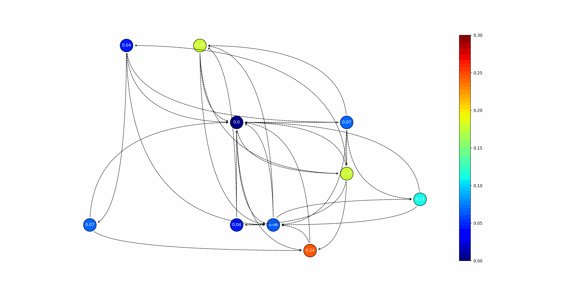
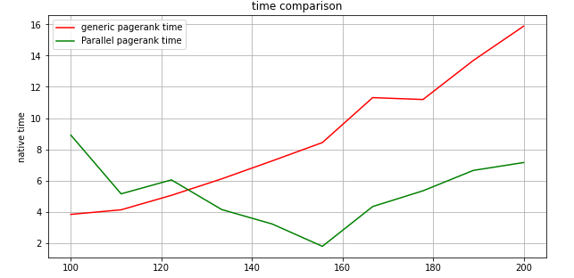

# Parallel-personalised-page-rank
This repository contains code for implementation of parallelized pagerank algorithm on dummy adjacency matrix but can be used in other real cases as well 

The notebook generates randomised adjacency marix and visualization of real time changing pageranks for implementational proof to the user, new nodes are introduced and personalized pagerank is computer in real time

we found that our implementation improved computing times as follows: 

where x axis represents the number of nodes in our network and y axis is the time of native parallel pagerank in seconds
